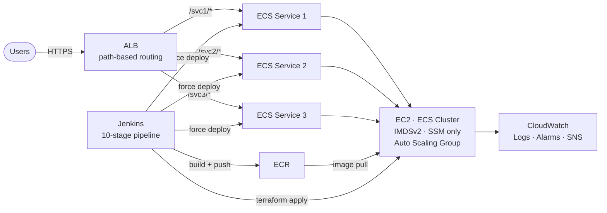

# system-design

Production infrastructure patterns, architecture references, and reusable CI/CD templates built from real deployments.

---

## What's Here

### [`ecs-cicd-platform/`](ecs-cicd-platform/)

A production-grade template for running 3–7 microservices on AWS ECS (EC2 launch type) with a full Jenkins CI/CD pipeline. Distilled from two separate production environments.

**Pattern covers:**
- Single ALB with path-based routing to N microservices
- ECS on EC2 with Auto Scaling Group and ECS Capacity Provider
- 10-stage Jenkins pipeline: version management → Docker build → Trivy security scan → ECR push → Terraform apply → ECS deploy → smoke test
- Production approval gate, Slack notifications, workspace cleanup
- Full multi-file Terraform template: cluster, IAM, launch template, ASG + capacity provider, per-service task definitions, ALB routing, autoscaling, and CloudWatch alarms
- IMDSv2 enforced, SSM Session Manager instead of SSH (port 22 closed), `prevent_destroy` on critical prod resources
- Sanitized scripts for local builds, pushes, and force-redeploys

**Good fit:** cost-sensitive, 3–7 services, low-to-medium traffic, team owns both app and infra.

See [`ecs-cicd-platform/README.md`](ecs-cicd-platform/README.md) for full documentation.

---

## Architecture Overview



> Detailed diagram with IAM, security groups, CloudWatch alarms, and Terraform state: [`ecs-cicd-platform/architecture/infrastructure.md`](ecs-cicd-platform/architecture/infrastructure.md)

---

## Repository Layout

```
system-design/
├── README.md                         ← this file
└── ecs-cicd-platform/
    ├── README.md                     ← pattern overview, decisions, usage guide
    ├── architecture/
    │   ├── infrastructure.md         ← Mermaid AWS diagram
    │   └── cicd-pipeline.md          ← Mermaid 10-stage pipeline diagram
    └── template/
        ├── Jenkinsfile               ← production-grade declarative pipeline
        ├── terraform/
        │   ├── main.tf               ← cluster, SG, IAM, launch template, ASG, capacity provider, ALB listeners, log group
        │   ├── services.tf           ← per-service task def, service, target group, listener rule, autoscaling
        │   ├── cloudwatch.tf         ← EC2/ECS/ALB alarms + OOM log metric filter
        │   ├── data.tf               ← subnet, ALB, and IAM policy data sources
        │   ├── cluster-vars.tf       ← variable declarations (type + description)
        │   ├── cluster.auto.tfvars   ← variable values (placeholders to fill in)
        │   ├── outputs.tf            ← ALB DNS, cluster name/ARN, role ARN, etc.
        │   └── userdata.txt          ← EC2 bootstrap (ECS agent config, image prune cron)
        └── scripts/
            ├── build-docker-images.sh
            ├── push-images.sh
            └── refresh-microservices.sh
```
