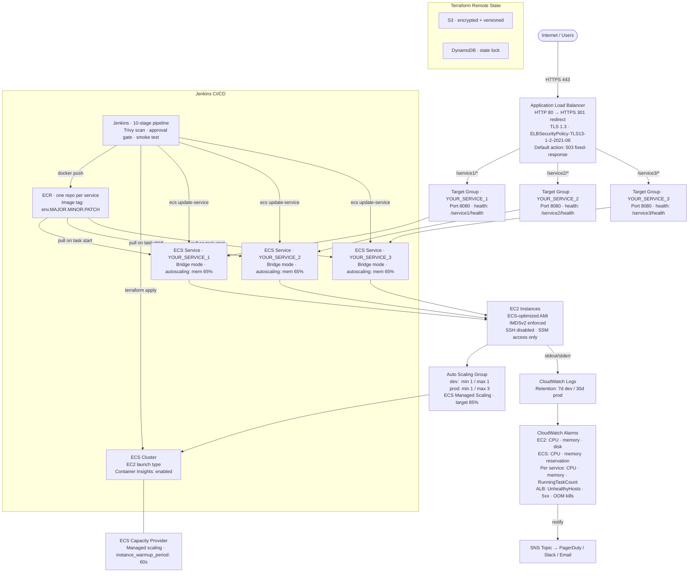
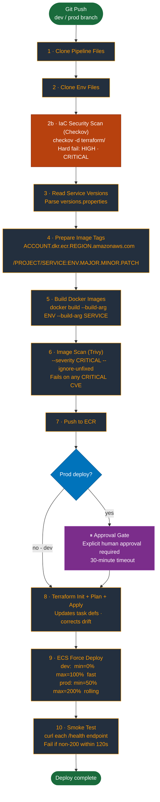

# ECS CI/CD Platform

A production-grade template for running multiple microservices on AWS ECS (EC2 launch type) with a fully automated Jenkins CI/CD pipeline. Adapted from two live production environments.

---

## What This Solves

| Problem | Solution |
|---|---|
| Running N services behind one domain | Single ALB with path-based routing (`/service1/*`, `/service2/*`, …) |
| Per-service load balancer costs | One ALB shared across all services — ~$18/month vs $18 × N |
| Cost-predictable container hosting | ECS on EC2 (t3a family) — 2–3× cheaper than equivalent Fargate |
| Container scaling without manual work | ECS Application Auto Scaling on memory utilization |
| Infra drift between deploys | Terraform runs on every pipeline execution — always converges to declared state |
| Stolen instance credentials via SSRF | IMDSv2 enforced (`http_tokens = "required"`); no SSH — access via SSM Session Manager only |
| Accidental destruction of prod state | `prevent_destroy` lifecycle on cluster, log group, and task execution role |
| Untested images reaching production | Trivy vulnerability scan after build — blocks on CRITICAL CVEs |
| No visibility into deploy status | Smoke test after deploy — curls each service health endpoint, fails pipeline if non-200 |
| Silent service outages | CloudWatch alarms on CPU/memory, zero-task count, unhealthy hosts, ALB 5xx, and OOM kills |
| Accidental prod deploys | Explicit approval gate before any production deploy |

---

## When to Use This Pattern

**Good fit:**
- 3–7 microservices sharing the same domain and TLS certificate
- Low-to-medium traffic (< ~500 req/s sustained per service)
- Cost-sensitive (startup, SME, or internal tooling budget)
- Team owns both application code and infrastructure
- Services share the same technology stack or base Docker image

**Consider alternatives when:**
- Services need independent domains or wildcard routing → separate ALBs or API Gateway
- > 10 microservices → service mesh (App Mesh, Istio) becomes more practical than path routing
- Traffic bursts unpredictably → Fargate or EKS for faster, finer-grained scaling
- Compliance requires network isolation per service → `awsvpc` network mode + per-task security groups

---

## Architecture Decisions

### Single ALB with path-based routing
One ALB handles all services via listener rules (`/admin/*` → admin TG, `/device/*` → device TG, …). Eliminates per-service ALB costs (~$18/month each) and consolidates TLS certificate management to one ACM cert. The HTTPS default listener action returns a fixed `503` — unmatched paths never silently fall through — and a separate HTTP listener redirects `:80` → `:443` (HTTP 301).

**Trade-off:** listener rule priority conflicts can silently misroute traffic. Each service defines an explicit `priority` on its `aws_lb_listener_rule` in `services.tf` (admin=100, device=200, client=300, store=400) — keep these unique when adding services.

### EC2 over Fargate
At low-to-medium scale, EC2 instances cost 2–3× less than equivalent Fargate resources. A single `t3a.small` can host 3–4 dev services simultaneously for ~$15/month. The trade-off is managing EC2 userdata, AMI updates, and capacity provider configuration.

### Memory-based autoscaling (target 65%)
`ECSServiceAverageMemoryUtilization` is used instead of CPU. JVM and Node.js services produce noisy CPU spikes (GC, JIT warm-up) that would trigger unnecessary scale events. Memory footprints are more stable and correlate better with sustained load.

### Terraform on every deploy
Terraform runs every pipeline execution (not only when infrastructure files change). This guarantees drift correction — any manual Console change is reverted on the next deploy. Overhead: ~30–90s per run. Skip stages 8 (Terraform) in a lightweight variant if infra is stable.

### Build-arg injection from single Dockerfile
Where services share a runtime, one Dockerfile accepts `--build-arg SERVICE=name` and `--build-arg ENV=dev|prod` to produce all images. Keeps build tooling unified and avoids duplicating base image layers in ECR.

### Trivy security scan before push
Images are scanned locally immediately after build (before ECR push). CRITICAL vulnerabilities fail the pipeline. `--ignore-unfixed` prevents blocking on CVEs with no available fix.

### SSM over SSH
Port 22 is closed on all EC2 instances. Access is via AWS Systems Manager Session Manager — full audit trail, no key management, no open ports.

---

## Architecture

### AWS Infrastructure



> Full diagram with IAM, security group, and Secrets Manager detail: [`architecture/infrastructure.md`](architecture/infrastructure.md)

---

### CI/CD Pipeline



> Full diagram with stage breakdown, dev vs prod config, and version tagging convention: [`architecture/cicd-pipeline.md`](architecture/cicd-pipeline.md)

---

## Prerequisites

| Tool | Version | Purpose |
|---|---|---|
| Terraform | `>= 1.5` | Infrastructure provisioning |
| AWS CLI | `>= 2.x` | ECR auth, ECS deploys, Secrets Manager |
| Docker | `>= 20.x` | Image builds and pushes |
| Jenkins | `>= 2.400` | Pipeline execution |
| Trivy | `>= 0.50` | Container image vulnerability scanning |
| Jenkins plugins | `Slack Notification`, `Pipeline`, `Credentials Binding` | Pipeline features |

**AWS IAM permissions required by Jenkins agent:**
```
ecr:GetAuthorizationToken
ecr:BatchCheckLayerAvailability / PutImage / InitiateLayerUpload / UploadLayerPart / CompleteLayerUpload
ecs:UpdateService / DescribeServices
secretsmanager:GetSecretValue
s3:GetObject / PutObject / ListBucket  (Terraform state)
dynamodb:GetItem / PutItem / DeleteItem (Terraform state lock)
iam / ec2 / ecs / logs / autoscaling   (Terraform apply)
```

---

## How to Use the Template

### 1. Configure Terraform backend
Edit `template/terraform/main.tf` — fill in the `backend "s3"` block:
```hcl
backend "s3" {
  bucket         = "your-terraform-state-bucket"
  key            = "your-project/dev/terraform.tfstate"
  region         = "YOUR_REGION"
  encrypt        = true
  dynamodb_table = "your-terraform-lock-table"
}
```

### 2. Fill in `cluster.auto.tfvars`
Edit `template/terraform/cluster.auto.tfvars` and replace the `YOUR_*` placeholders. Terraform loads `*.auto.tfvars` automatically:
```hcl
region                = "eu-west-1"
vpc_id                = "vpc-xxxxxxxxxxxxxxxxx"
subnet_name           = "my-platform-private-subnet"   # tag:Name of the target subnets
ecs_instance_ami      = "ami-xxxxxxxxxxxxxxxxx"          # ECS-optimized AMI for your region
instance_type         = "t3a.medium"
ssl_cert_arn          = "arn:aws:acm:..."
alb_id                = "arn:aws:elasticloadbalancing:..."
lb_sec_gr_id          = "sg-xxxxxxxxxxxxxxxxx"           # ALB security group
ecr_registry          = "123456789012.dkr.ecr.eu-west-1.amazonaws.com"
default_resource_name = "my-platform-PRODUCTION"         # prefix for all resource names/tags
project_name          = "my-platform"                    # ECR image path prefix
environment           = "production"                     # value used in resource tags
alert_topic_arn       = "arn:aws:sns:..."                # leave "" to disable alarm actions
```

**Service image versions** are injected at apply time via `TF_VAR_*` environment variables (the pipeline sets these from `versions.properties`). For a manual apply, export them or uncomment the entries at the bottom of `cluster.auto.tfvars`:
```bash
export TF_VAR_YOUR_SERVICE_1_VERSION="prod.1.0.0"
export TF_VAR_YOUR_SERVICE_2_VERSION="prod.1.0.0"
export TF_VAR_YOUR_SERVICE_3_VERSION="prod.1.0.0"
export TF_VAR_YOUR_SERVICE_4_VERSION="prod.1.0.0"
```

> **Adapting services:** the template ships with four example services (admin, device, client, store) as explicit resources in `services.tf`. Rename, add, or remove service blocks there — each block is a task definition + service + target group + listener rule + autoscaling target/policy. Keep listener-rule priorities unique, and rename the matching `YOUR_SERVICE_*_VERSION` variables in `cluster-vars.tf`.

### 3. Bootstrap infrastructure
```bash
cd template/terraform
terraform init
terraform plan
terraform apply
```

### 4. Set up Jenkins pipeline
- Create a Jenkins pipeline job pointing to `template/Jenkinsfile`
- Set `DEPLOY_ENV` to `dev` or `prod` in the pipeline environment
- Create Jenkins credentials:
  - `YOUR_PIPELINE_REPO_CRED_ID` — SSH key or token for pipeline repo
  - `YOUR_ENV_FILES_REPO_CRED_ID` — SSH key or token for env files repo
- Configure Slack Notification plugin with workspace + bot token

### 5. Trigger a deploy
Push to the configured branch. The pipeline will:
1. Clone source + env files
2. Read and bump the service version
3. Build + scan + push Docker images
4. Run Terraform (init → plan → apply)
5. Force-deploy ECS services
6. Run smoke tests against each health endpoint

---

## File Reference

| File | Purpose |
|---|---|
| `architecture/infrastructure.md` | Mermaid AWS architecture diagram |
| `architecture/cicd-pipeline.md` | Mermaid 10-stage pipeline diagram + stage breakdown |
| `template/Jenkinsfile` | Declarative Jenkins pipeline (10 stages + approval gate + Slack) |
| `template/terraform/main.tf` | Cluster, security group, IAM, launch template, ASG, capacity provider, ALB listeners, task execution role, log group |
| `template/terraform/services.tf` | Per-service task definition, service, target group, listener rule, and memory autoscaling |
| `template/terraform/cloudwatch.tf` | EC2/ECS/service/ALB alarms + OOM-kill log metric filter |
| `template/terraform/data.tf` | Subnet, ALB, and IAM policy document data sources |
| `template/terraform/cluster-vars.tf` | All variable declarations with type and description |
| `template/terraform/cluster.auto.tfvars` | Variable values — placeholders to fill in before `terraform apply` |
| `template/terraform/outputs.tf` | ALB DNS, cluster name/ARN, task execution role ARN, listener ARN, SG ID, ASG name |
| `template/terraform/userdata.txt` | EC2 bootstrap — ECS agent config + weekly `docker image prune` cron |
| `template/scripts/build-docker-images.sh` | Local Docker build with `--build-arg` injection |
| `template/scripts/push-images.sh` | ECR login, tag, and push for all services |
| `template/scripts/refresh-microservices.sh` | Force-redeploy all ECS services without a full pipeline run |

---

## Scripts

The scripts in the [`scripts/`](template/scripts/) folder are standalone versions of the pipeline steps, meant for manual use outside of Jenkins — local testing, emergency deployments, or one-off operations when running the full pipeline is unnecessary or impractical.

| Script | When to use it |
|---|---|
| `build-docker-images.sh` | Build the service images locally without running the full pipeline. |
| `push-images.sh` | Push already-built images to ECR manually. |
| `refresh-microservices.sh` | Force-redeploy the ECS services without rebuilding images — useful after a Secrets Manager rotation or to recover a stuck task. |
