# CI/CD Pipeline

A 10-stage Jenkins pipeline that handles the full lifecycle: version management, Docker build, security scan, ECR push, infrastructure update, ECS deployment, and smoke testing. A mandatory approval gate fires before any production deploy.

---

## Pipeline Flow

```mermaid
flowchart TD
    Push(["Git Push
    dev / prod branch"])

    Push --> S1["1 · Clone Pipeline Files
    Checkout source repo
    Pull build credentials
    from Jenkins credential store"]

    S1 --> S2["2 · Clone Env Files
    Fetch private config repo
    containing .env / tfvars files
    for this environment"]

    S2 --> S3["3 · Read Service Versions
    Parse versions.properties
    for each service version
    e.g. YOUR_SERVICE_1=1.4.2"]

    S3 --> S4["4 · Prepare Image Tags
    Build full ECR URI per service
    ACCOUNT.dkr.ecr.REGION.amazonaws.com
      /PROJECT/SERVICE:ENV.MAJOR.MINOR.PATCH"]

    S4 --> S5["5 · Build Docker Images
    docker build
    --build-arg ENV=dev|prod
    --build-arg SERVICE=name
    One Dockerfile → N images"]

    S5 --> S6["6 · Security Scan
    trivy image --severity CRITICAL
    --ignore-unfixed --exit-code 1
    Fails build on any CRITICAL CVE
    Runs against each local image"]

    S6 --> S7["7 · Push to ECR
    aws ecr get-login-password
    docker tag + docker push
    per service image"]

    S7 --> Gate{"Prod deploy?
    DEPLOY_ENV == prod"}

    Gate -->|"yes"| Approval["⏸ Approval Gate
    input: Deploy to PRODUCTION?
    Waits for explicit human approval
    Times out after 30 minutes"]

    Gate -->|"no (dev)"| S8

    Approval --> S8

    S8["8 · Terraform Init + Plan + Apply
    terraform init -reconfigure
    terraform plan -var service_versions
    terraform apply
    Updates task definitions with new image URIs
    Corrects any infrastructure drift"]

    S8 --> S9["9 · ECS Force Deploy
    aws ecs update-service
    --force-new-deployment
    dev:  min=0%  max=100%  (fast)
    prod: min=50% max=200%  (rolling)"]

    S9 --> S10["10 · Smoke Test
    Read ALB DNS from Terraform output
    curl -sk each health endpoint
    Fail pipeline if any returns non-200
    Wait up to 120s for service to stabilise"]

    S10 --> Done(["Deploy complete
    New tasks healthy
    Version committed to git"])

    classDef stage    fill:#232F3E,color:#FF9900,stroke:#FF9900
    classDef gate     fill:#7B2D8B,color:#fff,stroke:#9B4DB0
    classDef terminal fill:#1A6B3C,color:#fff,stroke:#1A6B3C
    classDef decision fill:#0073BB,color:#fff,stroke:#005A8E

    class S1,S2,S3,S4,S5,S6,S7,S8,S9,S10 stage
    class Approval gate
    class Push,Done terminal
    class Gate decision
```



---

## Stage Breakdown

| # | Stage | Purpose | Fails build on |
|---|---|---|---|
| 1 | **Clone Pipeline Files** | Check out the application source repo; bind Jenkins credentials for AWS and git | Auth failure, missing branch, network error |
| 2 | **Clone Env Files** | Fetch a separate private config repo holding `.env` and environment-specific tfvars | Repo access denied, missing branch |
| 3 | **Read Service Versions** | Parse `versions.properties` to get the current version per service | File missing or malformed |
| 4 | **Prepare Image Tags** | Construct full ECR URIs (`ACCOUNT.dkr.ecr.REGION.amazonaws.com/PROJECT/SERVICE:ENV.x.y.z`) | — (computed step) |
| 5 | **Build Docker Images** | `docker build --build-arg` per service; single Dockerfile → N images | Build error, compilation failure, failing tests |
| 6 | **Security Scan (Trivy)** | Scan each local image for CRITICAL CVEs; `--ignore-unfixed` skips CVEs with no fix available | Any CRITICAL vulnerability with available fix |
| 7 | **Push to ECR** | ECR auth, tag each image with full registry URI, push | ECR auth error, push failure, quota exceeded |
| — | **Approval Gate** *(prod only)* | `input` step pauses pipeline and waits for explicit approval; 30-minute timeout | Approver rejects; times out |
| 8 | **Terraform Init + Plan + Apply** | Reconfigure backend, plan with new image versions, apply; updates task definitions and corrects drift | Plan errors, apply errors, state lock timeout |
| 9 | **ECS Force Deploy** | `aws ecs update-service --force-new-deployment`; dev uses fast kill/replace, prod uses rolling | Service fails to start; AWS API error |
| 10 | **Smoke Test** | Read ALB DNS from Terraform output; `curl` each service health endpoint; fail if non-200 within 120s | Any health endpoint returns non-2xx or times out |

---

## Dev vs Prod Deployment Configuration

The `--deployment-configuration` flag controls how ECS replaces tasks during a force-new-deployment:

| Setting | Dev | Prod | What it means |
|---|---|---|---|
| `minimumHealthyPercent` | `0` | `50` | Minimum % of desired tasks that must stay running during replacement |
| `maximumPercent` | `100` | `200` | Maximum % of desired tasks allowed to run simultaneously |
| **Behaviour** | Kill old task → start new *(fast, brief downtime OK)* | Start new task → health check → drain old *(zero-downtime rolling)* |
| Requires | 1 task slot | Enough instance capacity for 2× desired tasks |

**Prod example with `desired_count = 1`:**
`maximumPercent = 200` → ECS starts the new task (2 tasks running), waits for health check pass, then stops the old task. `minimumHealthyPercent = 50` means at least 1 task must be healthy at all times — the drain never drops to zero.

---

## Version Tagging Convention

```
dev.MAJOR.MINOR.PATCH   →  dev.0.12.1
prod.MAJOR.MINOR.PATCH  →  prod.1.4.2
```

Versions are stored in `versions.properties` at the repo root. The pipeline reads this file, optionally increments the patch, and passes the version to both the Docker image tag and Terraform's `service_versions` variable. Every deployed image version is traceable in git history.

```properties
# versions.properties
YOUR_SERVICE_1=1.4.2
YOUR_SERVICE_2=1.4.2
YOUR_SERVICE_3=0.9.1
```

---

## Post-Pipeline Actions

| Event | Action |
|---|---|
| **Always** | `cleanWs()` — removes workspace to prevent stale files affecting next run |
| **Success** | Slack message to `YOUR_SLACK_CHANNEL`: ✅ service, version, environment |
| **Failure** | Slack message: ❌ job name, failed stage name, environment, link to build logs |
