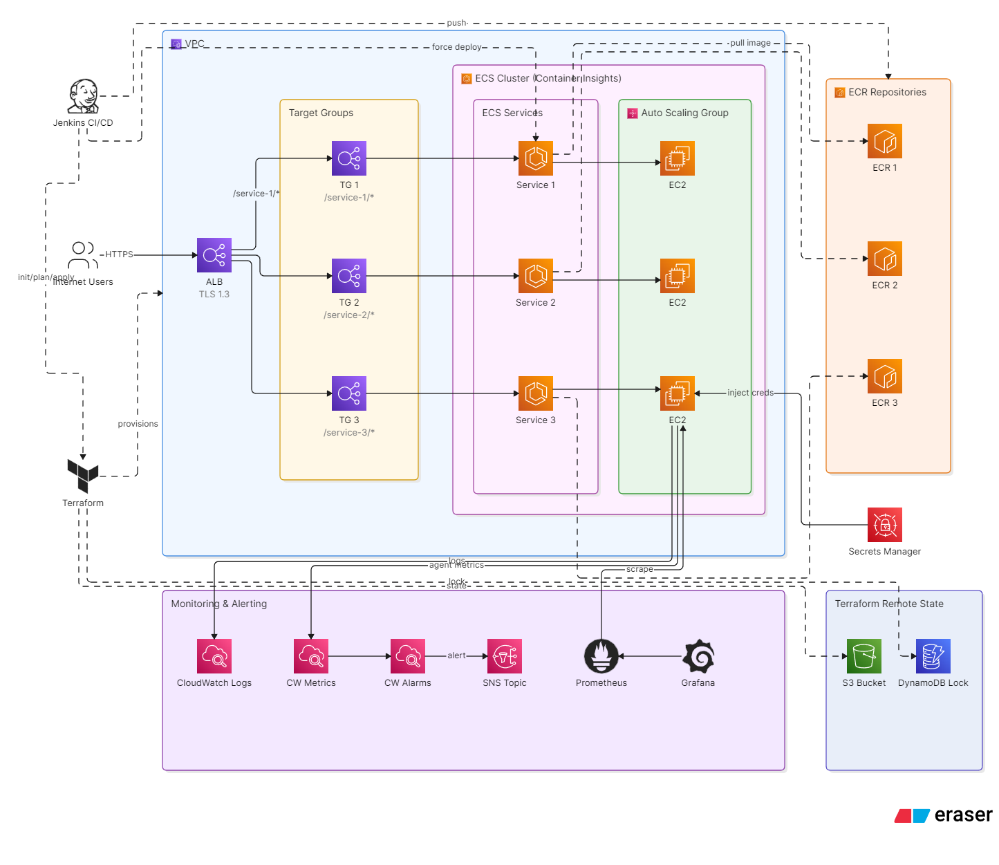
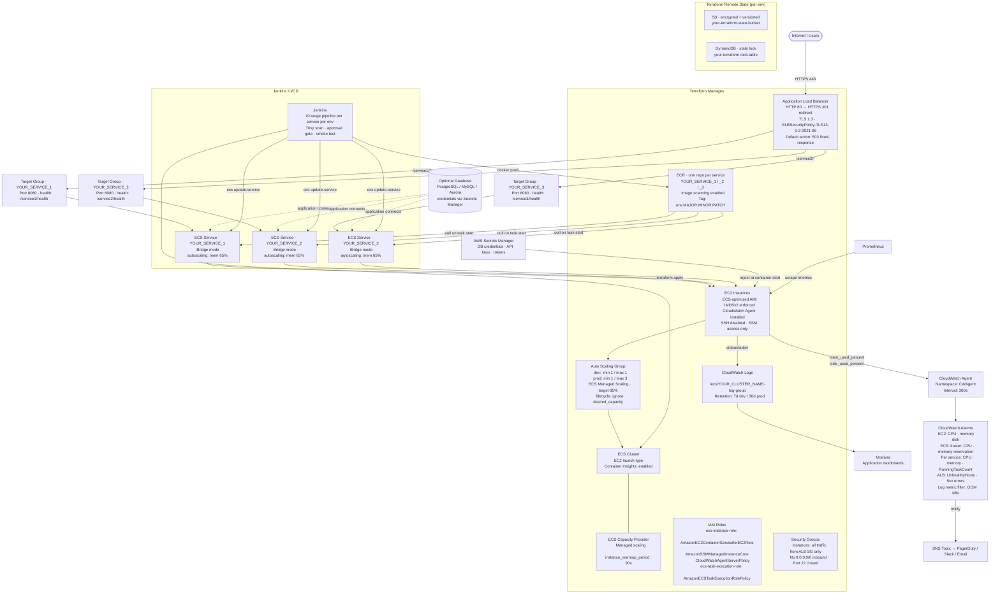

# Infrastructure Architecture

Generic AWS infrastructure diagram for the ECS CI/CD Platform pattern. Replace `YOUR_SERVICE_1/2/3` with your actual service names — add or remove service blocks to match your count.

---
## Architecture Diagram

## AWS Architecture

---

## IAM Role Summary

| Role | Policies | Used By |
|---|---|---|
| `ecs-instance-role` | `AmazonEC2ContainerServiceforEC2Role` — register with ECS cluster | EC2 instance profile |
| `ecs-instance-role` | `AmazonSSMManagedInstanceCore` — SSM Session Manager access | EC2 instance profile |
| `ecs-instance-role` | `CloudWatchAgentServerPolicy` — publish mem/disk metrics | EC2 instance profile |
| `ecs-task-execution-role` | `AmazonECSTaskExecutionRolePolicy` — pull from ECR, write to CloudWatch Logs | ECS task definition |

> ⚠️ **Common mistake:** `AmazonEC2ContainerServiceforEC2Role` is for the **EC2 instance profile only**. The task execution role must use `AmazonECSTaskExecutionRolePolicy` (grants ECR pull + CloudWatch Logs write). Attaching the EC2 policy to a task execution role grants unnecessarily broad permissions.

---

## Security Decisions

| Decision | Implementation |
|---|---|
| No open SSH | Port 22 ingress rule removed; access via SSM Session Manager |
| ALB-only inbound | Instance SG accepts all traffic from ALB SG only (`security_groups = [lb_sec_gr_id]`) |
| IMDSv2 enforced | `metadata_options { http_tokens = "required" }` on launch template — blocks SSRF credential theft |
| Secrets Manager, not env vars | Credentials injected via ECS task definition `secrets` block — never in Dockerfile or state |
| Trivy scan pre-push | CRITICAL CVEs fail the pipeline before image reaches ECR |
